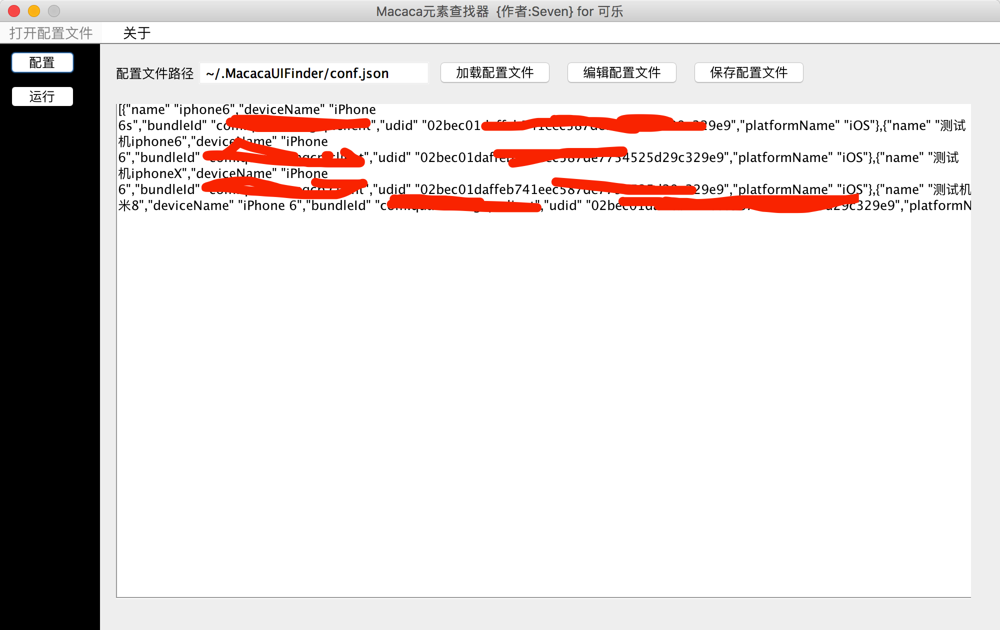
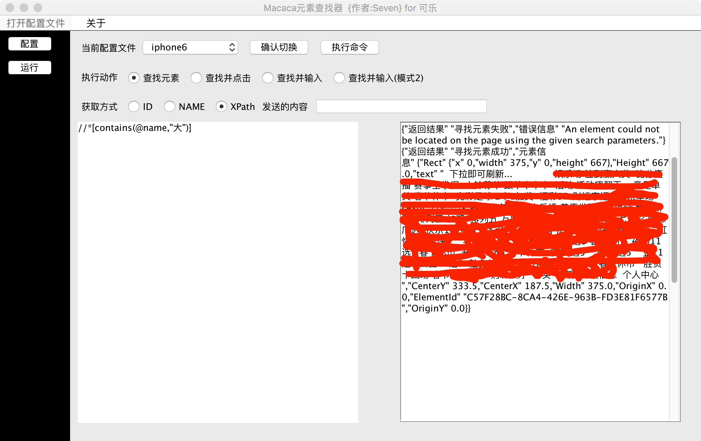

# MacacaElementUI元素查找器

### 1. 这是什么?
1. 这是一个用JavaSwing写的Macaca元素查找器,方便测试的小伙伴们定位元素.

### 2. 为了什么?
1. 为了解决在`app-inspector`上找到元素后,没一次在Java中启动Macaca(启动链接MacacaServer的过程)定位元素巨慢,有时候一个元素定位失败了,
就要关闭`macaca-server`,然后启动`app-inspector`,找到元素,然后在次切换到`macaca-server`.我这里推荐启动`app-inspector`后开很多
浏览器tab页面,把需要定位元素的页面都在tab中打开,然后打开本软件一次寻找元素,确认无误后拷贝出可用的定位串,直接在Java的测试用例中使用,而不必
为了一个元素没有定位到反复重启`Macaca-client(启动链接是一个非常耗时的动作)`.
2. 还为了什么?为了我的女朋友...也为了更多挣扎在自动化UI测试的小伙伴们.
### 3. 为什么代码这么Low.
1. 没办法,代码几乎一天抽时间写出来的.而且Swing的布局实在是`恶心`,本来想用JavaFX,但是没有找到好的资料,不过写完后发现了个`TornadoFX`,用
Kotlin写DSL,真是在好用了.大家可以尝试下

### 4. 配置文件格式
1. 具体参照官方Demo里面的Json字段来填写[sample-java](https://github.com/macaca-sample/sample-java/)
```json
[
    {
        "name":"iphoneX",
        "deviceName":"iPhone X",
        "bundleId":"测试包bundleId",
        "udid":"真实设备的udid",
        "platformName":"iOS"
    },
    {
        "name":"小米8",
        "deviceName":"xiaomi 8",
        "app": "apk下载路径",
        "udid":"真实设备的udid",
        "platformName":"android"
    }
]
```
### 5. 启动命令
直接`git clone`本项目或者下载`MacacaElementUI-1.0.jar`然后直接执行`java -jar MacacaElementUI-1.0.jar`即`食用`该软件.

### 5. 关于设计
1. 虽然很low,但是总体还是有设计可寻
在写这个UI的时候为了避免层层嵌套,采用了事件发布订阅模式,每触发一个按钮/组件,
就会发布对应的事件到事件管理者,然后事件管理者会才用线程分发的模式来分发这个事件给对应的
订阅者,从而完成UI/事件的处理与各个`JComponent`的分离.

### 6. 实际效果
1. 配置页面

2. 执行页面


### 7. 提示
1. 软件可能有未知bug.
2. 目前处于测试阶段,勿喷.

<hr>

## 作者:[Accelerator](https://www.zhihu.com/people/Sweets07)

## Email:[hacker.kill07@gmail.com](hacker.kill07@gmail.com)

## 吾爱Java(QQ群):[170936712（点击加入）](https://link.zhihu.com/?target=https://jq.qq.com/%3F_wv%3D1027%26k%3D41oCCMn)